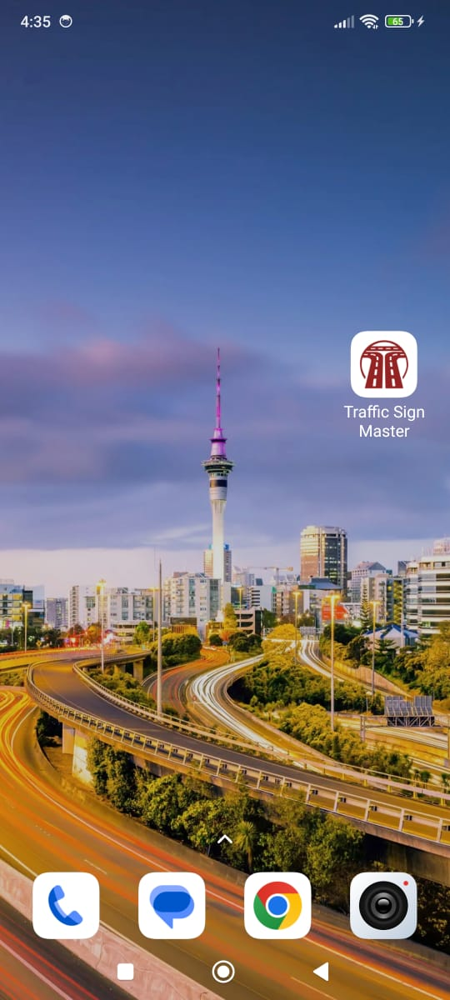

# SCREENSHOTS OF MOBILE APPLICATION

## LOGIN PAGE
_The following screen is integrated with Firebase Auth and users can login to the app via account created_

## RESET PAGE
_In this screen user can reset their password by providing the registered mobile number_

## CHANGE PASS SCREEN
_User is navigated at this screen once the mobile number is verified from Firebase so that the user can change the password_

## SIGN UP PAGE
_At this screen user can create the account. This screen is also integrated with Firebase and have validation rules._

## FIRST APP LAUNCH
_When user install our app, Signup and Login to our app, the user is asked for Location Permissions_

## HOME SCREEN
_This is the Home Screen of my application from where user can navigate to different sections of the app_

## MAP SCREEN
_From the Bottom Navbar user can switch to Map Screen. This screen is integrated with Google Maps. It shows user the current location_

## NEWS SCREEN
_This screen is integrated with a News Webpage. I created this screen for learning purposes and to demonstrate how webpage is loaded in mobile app_

## APPLICATION NAVBAR
_In my mobile application to increase the user friendliness I provide user to ways to navigate my application. Drawer and Bottom GNav Bar_

## SELECT IMAGE SCREEN
_From the Home Screen when user tap the Gallery option to select the traffic sign, this screen is shown to select and upload the image for processing_

## CROP IMAGE
_When the user select the sign image, this screen is there to allow the user to crop the image_

## CROP OUT
_After cropping the image this screen is shown_

## OUTPUT OF THE ALGORITHM
_When the user taps the Detect Sign Button, the image is send to the Flask Api to process it using ML and generated response is shown_

## TEXT-TO-SPEECH FEATURE
_User can hear the generated Sign Name. Two accents of English is added and when user tap the hear icon the sign name is speaked_

## SIGNS GUIDE
_From the home screen user can navigate to this screen where information of different sign is presented. This screen is demonstration of using Horizontal Navbar_

## PROFILE SCREEN
_From either drawer or navbar user can navigate to this screen to view his profile or edit it_

## EDIT PROFILE
_At this screen user can edit the profile. This screen is integrated with Firebase and validation rules_

## CHANGE PROFILE PHOTO
_In the edit profile page when user wants to change his profile photo the bottom sheet is show. He can either upload picture from gallery or take picture using cellphone camera. The selected image is updated in the UI_

## USER FEEDBACK
_From the app drawer when user tap Rate our App. the following screens are shown and the user feedback is sent and stored in Firebase for the logged in user_

## ABOUT DEV PAGE
_This is a static screen which shows information about the developers and about the project_

## SETTINGS PAGE
_App settings screen where user can manage application settings like location access, dark mode (not implementd) and other settings. This screen demonstrates what basic application settings page look like_

## CONTACT PAGE
_This page has forum which user can use and contact us. This page is also integrated with Firebase and validation rules_

## PRIVACY POLICY
_This is a static screen which shows app privacy and policy_

## APPLICATION ICON
_My application Icon on Android_

